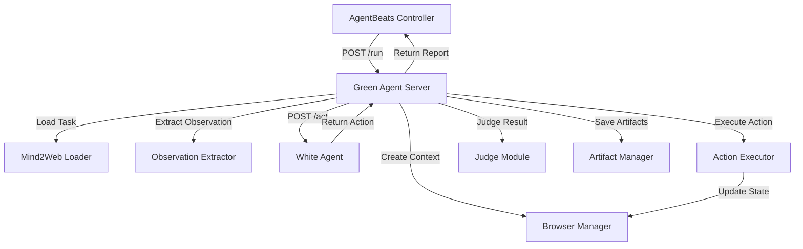

# AgentBeats v2 Green Agent Upgrade Plan

## Overview

Transform the existing `greenagent` codebase into a production-ready AgentBeats v2-compatible Green Agent that can load Mind2Web tasks, orchestrate remote white agents, execute actions in Playwright, and return structured evaluation results.

## Architecture Flow



## Implementation Tasks

### 1. AgentBeats v2 Packaging

**1.1 Create `run.sh` at repo root**

- Location: `/Users/joshkoe/Documents/GitHub/greenagent/run.sh`
- Make executable, use `$HOST` and `$AGENT_PORT` env vars
- Start FastAPI server via uvicorn pointing to `webnav.app.main:app`

**1.2 Add Agent Card endpoint**

- File: `webnav/app/main.py`
- Endpoint: `GET /.well-known/agent-card.json`
- Return JSON with agent metadata, capabilities, endpoints

**1.3 Enhance existing endpoints**

- File: `webnav/app/main.py`
- Update `/health` to include version
- Ensure `/reset` properly cleans up browser contexts and temp dirs

### 2. New `/run` Endpoint

**2.1 Create request/response models**

- File: `webnav/app/models.py`
- Add `RunRequest`, `RunResponse`, `TaskSpec`, `WhiteAgentConfig`, `RunLimits`, `RunMetrics`, `RunArtifacts`
- Support both new `/run` format and existing `/task` format

**2.2 Implement `/run` endpoint**

- File: `webnav/app/main.py`
- Accept `RunRequest` with task, white_agents, limits
- Call internal `run_evaluation()` function
- Return `RunResponse` with metrics and artifacts

**2.3 Create internal `run_evaluation()` function**

- File: `webnav/app/controller.py`
- Core orchestration logic that both `/run` and `/task` can call
- Handles step-by-step execution loop

### 3. Mind2Web Integration

**3.1 Create Mind2Web loader module**

- File: `webnav/app/mind2web_loader.py`
- Load tasks from `MIND2WEB_DATA_DIR` env var or local `data/mind2web_sample.json`
- Parse Mind2Web JSON format into internal `TaskSpec`
- Support fields: task_id, instruction, start_url, gold_actions (optional), assets

**3.2 Create sample Mind2Web data**

- File: `webnav/data/mind2web_sample.json`
- Include 1-3 sample tasks in Mind2Web format
- Include gold_actions for trace matching

**3.3 Update TaskSpec model**

- File: `webnav/app/models.py`
- Extend `TaskSpec` to support Mind2Web fields (benchmark, split, index, assets, gold_actions)
- Maintain backward compatibility with existing tasks.json format

### 4. Observation Extraction

**4.1 Create observation extractor**

- File: `webnav/app/observation.py`
- Function: `extract_observation(page: Page) -> dict`
- Extract: current_url, page_title, DOM summary (visible links/buttons/inputs with selectors)
- Optionally include screenshot path reference

**4.2 DOM summary extraction**

- Extract interactive elements with stable selectors
- Include element text, type, and CSS selector
- Keep it lightweight (max 50-100 elements)

### 5. White Agent Client

**5.1 Create white agent client**

- File: `webnav/app/white_agent_client.py`
- Class: `WhiteAgentClient`
- Method: `call_agent(url: str, payload: dict, timeout: int) -> dict`
- Default path: `/act` (configurable via `WHITE_AGENT_ACT_PATH` env var)
- Handle timeouts (15-30s), invalid JSON, retry logic

**5.2 Action validation**

- Validate returned actions against allowed schema
- Support: click, type, select, scroll, wait, stop
- Validate selector format (CSS or XPath)
- Return structured error on invalid action

### 6. Action Execution

**6.1 Create action executor**

- File: `webnav/app/action_executor.py`
- Class: `ActionExecutor`
- Method: `execute_action(page: Page, action: dict) -> dict`
- Execute each action type in Playwright
- Return execution result (success/error, error message, new URL)

**6.2 Implement action handlers**

- `click`: page.click(selector)
- `type`: page.fill(selector, text) + optional press_enter
- `select`: page.select_option(selector, value)
- `scroll`: page.evaluate(f"window.scrollBy(0, {delta_y})")
- `wait`: asyncio.sleep(ms / 1000)
- `stop`: return stop reason

### 7. Enhanced Artifact Management

**7.1 Update artifact saving**

- File: `webnav/app/logging_utils.py`
- Create `artifacts/{run_id}/` directory structure
- Save `events.jsonl` (one JSON line per step with observation hash, action, result, timestamp, URL)
- Save screenshots per step (or on failure)
- Enable Playwright tracing to `pwtrace.zip`
- Save consolidated log file

**7.2 Update artifact paths**

- Return artifact paths in `RunResponse.artifacts`
- Include: log_path, trace_zip, screenshots_dir, playwright_trace

### 8. Enhanced Metrics & Judging

**8.1 Update judge module**

- File: `webnav/app/judge.py`
- Add `judge_final_success()` for deterministic success checking
- Support success_criteria: url_contains, text_present, selector_present
- Add `compute_trace_match()` for gold_actions comparison
- Compute trace_match_ratio (steps where action type + target match)

**8.2 Update metrics model**

- File: `webnav/app/models.py`
- Add `RunMetrics` with: final_success (0/1), steps_taken, trace_match_ratio, wall_time_s, timeouts, invalid_actions

### 9. Step-by-Step Execution Loop

**9.1 Implement execution loop**

- File: `webnav/app/controller.py`
- In `run_evaluation()`:

  1. Load task (Mind2Web or legacy format)
  2. Create browser context
  3. Navigate to start_url
  4. Loop until stop or max_steps:

     - Extract observation
     - Call white agent
     - Validate action
     - Execute action
     - Record step in events.jsonl
     - Check for stop condition

  1. Judge final outcome
  2. Compute metrics
  3. Save all artifacts
  4. Return RunResponse

### 10. Stub White Agent for Testing

**10.1 Create test stub**

- File: `webnav/tests/stub_white_agent.py` (or `webnav/app/stub_white_agent_server.py`)
- Simple FastAPI server that returns deterministic actions
- Can be run locally for testing without external agents

### 11. Development Tools

**11.1 Create Makefile**

- File: `/Users/joshkoe/Documents/GitHub/greenagent/Makefile`
- `make dev`: Start server locally
- `make test_run`: Run sample task against stub white agent
- `make install`: Install dependencies

### 12. Documentation Updates

**12.1 Update README**

- File: `/Users/joshkoe/Documents/GitHub/greenagent/README.md`
- Add AgentBeats v2 compatibility section
- Document `/run` endpoint with example curl
- Document env vars: `HOST`, `AGENT_PORT`, `MIND2WEB_DATA_DIR`, `WHITE_AGENT_ACT_PATH`
- Update installation and running instructions

## File Structure Changes

```
greenagent/
├── run.sh (NEW)
├── Makefile (NEW)
├── README.md (UPDATED)
└── webnav/
    ├── app/
    │   ├── main.py (UPDATED - add /run, agent-card, enhance /health)
    │   ├── models.py (UPDATED - add RunRequest/Response, extend TaskSpec)
    │   ├── controller.py (UPDATED - add run_evaluation())
    │   ├── browser.py (MINOR - ensure proper cleanup)
    │   ├── judge.py (UPDATED - add trace matching, enhanced success criteria)
    │   ├── logging_utils.py (UPDATED - add events.jsonl, trace.zip support)
    │   ├── mind2web_loader.py (NEW)
    │   ├── observation.py (NEW)
    │   ├── white_agent_client.py (NEW)
    │   ├── action_executor.py (NEW)
    │   └── white_stub.py (KEEP - for backward compatibility)
    ├── data/
    │   ├── tasks.json (KEEP - existing format)
    │   └── mind2web_sample.json (NEW)
    └── tests/ (NEW)
        └── stub_white_agent.py (NEW)
```

## Key Design Decisions

1. **Backward Compatibility**: Keep existing `/task` endpoint working, add `/run` as new standard
2. **Internal Refactoring**: Create `run_evaluation()` as shared internal function
3. **Task Format Support**: Support both legacy `tasks.json` and Mind2Web formats
4. **Artifact Structure**: Use `artifacts/{run_id}/` instead of `runs/{task_id}/` for `/run` endpoint
5. **Observation Format**: Lightweight DOM summary, not full HTML
6. **Action Validation**: Strict validation with clear error messages
7. **Error Handling**: Graceful degradation, always return structured response

## Testing Strategy

1. Test `/run` endpoint with sample Mind2Web task
2. Test white agent client with stub server
3. Test action execution for all action types
4. Test artifact generation (events.jsonl, trace.zip)
5. Test metrics computation (success, trace_match_ratio)
6. Verify backward compatibility with existing `/task` endpoint

## Dependencies

- Add `httpx` or `aiohttp` for white agent HTTP calls
- Ensure Playwright tracing is enabled
- No new major dependencies required